# FinanceFlow AI

<p align="center">
  
  
  
  
  
</p>

<p align="center">
  <strong>A graph-powered financial intelligence system.</strong><br/>
  Understand financial relationships, calculate decisions deterministically, and explain them with AI.
</p>

<p align="center">
  <a href="#system-architecture">Architecture</a> ·
  <a href="#decision-engine">Decision Engine</a> ·
  <a href="#case-studies">Case Studies</a> ·
  <a href="#dashboard">Dashboard</a> ·
  <a href="#quick-start">Run</a>
</p>

---

## Product Overview

FinanceFlow AI is a personal finance intelligence platform built around a simple architectural principle:

> **AI should explain financial decisions — not invent the financial facts behind them.**

Instead of sending a user's question directly to an LLM, FinanceFlow connects:

```text
Natural Language
       ↓
Financial Fact Extraction
       ↓
Neo4j Relationship Graph
       ↓
Relevant Context Retrieval
       ↓
Deterministic Financial Engine
       ↓
Verified Metrics
       ↓
AI Explanation
       ↓
Dashboard / API
```

The result is a system designed to reason over a **connected financial state** rather than isolated transactions or generic prompts.

---

# The Problem

Most consumer finance tools fall into one of two categories.

### Traditional finance software

```text
Transactions
     ↓
Tables
     ↓
Charts
     ↓
Manual interpretation
```

### Generic AI assistants

```text
Question
   ↓
LLM
   ↓
Answer
```

The first provides data without much reasoning.

The second provides reasoning without a reliable financial state.

FinanceFlow combines the two:

```text
             FINANCIAL DATA
                    │
                    ▼
           ┌─────────────────┐
           │  RELATIONSHIPS  │
           │     Neo4j       │
           └────────┬────────┘
                    │
                    ▼
           ┌─────────────────┐
           │  FINANCIAL MATH │
           │     Python      │
           └────────┬────────┘
                    │
                    ▼
           ┌─────────────────┐
           │ AI EXPLANATION  │
           └─────────────────┘
```

This architecture is the core of the project.

---

# What Makes It Different?

A conventional finance application might know:

```text
Salary        ₹1,20,000
Expenses        ₹72,000
EMI             ₹18,000
Savings         ₹48,000
```

FinanceFlow attempts to understand how those values are related:

```mermaid
flowchart TD

    U["User"]

    U --> A["Account"]
    A --> I["Income"]
    A --> E["Expenses"]

    U --> D["Debt"]
    D --> EMI["EMI"]

    U --> P["Portfolio"]
    P --> AS["Assets"]

    U --> G["Financial Goal"]
    G --> EF["Emergency Fund"]

    I --> CF["Cash Flow"]
    E --> CF
    EMI --> CF

    CF --> S["Savings Rate"]
    CF --> NW["Net Worth"]
    CF --> R["Emergency Runway"]

    S --> H["Financial State"]
    NW --> H
    R --> H
```

The distinction is therefore not simply "AI-powered budgeting."

It is **relationship-aware financial reasoning**.

---

# System Architecture

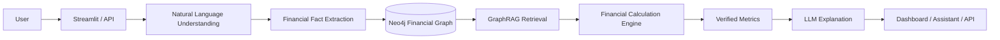

### Responsibility is deliberately separated

| Layer         | Responsibility                           |
| ------------- | ---------------------------------------- |
| NLU           | Understand user language                 |
| Neo4j         | Store financial entities + relationships |
| GraphRAG      | Retrieve relevant context                |
| Python Engine | Perform deterministic calculations       |
| LLM           | Explain results                          |
| Streamlit     | Present insights                         |
| FastAPI       | Expose the system programmatically       |

---

# A Financial Question, End to End

Consider:

> **"Can I afford a ₹35,000 laptop?"**

FinanceFlow does not immediately ask an LLM for a yes/no answer.

It follows a decision pipeline.

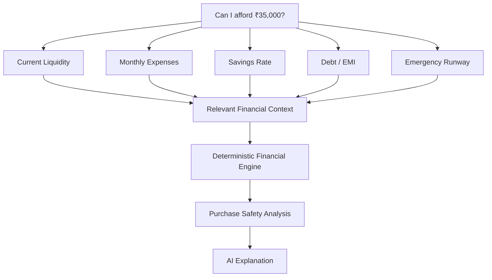

The answer is therefore grounded in the user's actual financial state.

---

# Decision Engine

The financial engine is the deterministic core of the application.

The LLM is not expected to perform the arithmetic.

### Example metrics

```text
Monthly Savings
= Income − Expenses

Savings Rate
= (Income − Expenses) / Income

Net Worth
= Assets − Liabilities

Emergency Runway
= Liquid Reserves / Monthly Expenses

Debt-to-Income
= Debt Payments / Gross Income
```

Conceptually:

```text
                    Financial Graph
                           │
                           ▼
                 ┌───────────────────┐
                 │ Financial Engine  │
                 └─────────┬─────────┘
                           │
          ┌────────────────┼────────────────┐
          ▼                ▼                ▼
      Cash Flow         Net Worth        Debt Load
          │                │                │
          └────────────────┼────────────────┘
                           ▼
                    Financial State
```

This separation makes the numerical layer easier to inspect and test.

---

# GraphRAG Layer

The graph is not simply used as storage.

It provides the connected context required for a question.

For a purchase question, the system may retrieve:

```text
Account Balance
      │
      ├── Monthly Income
      ├── Monthly Expenses
      ├── Existing EMI
      ├── Emergency Reserve
      ├── Savings Rate
      └── Financial Goals
```

Then:

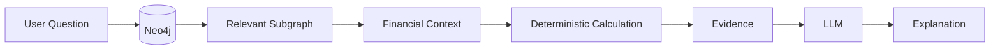

This is the practical role of GraphRAG in the system.

---

# From Raw Event to Financial Insight

A transaction can begin as ordinary language:

```text
"I spent ₹3,400 on groceries yesterday."
```

The system turns that into a structured financial event:

```text
Entity
├── User
├── Amount: ₹3,400
├── Category: Groceries
├── Type: Expense
└── Date: Yesterday
```

Then:

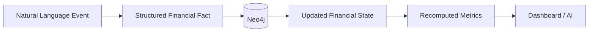

This means the financial state evolves from **events**, not just manually entered dashboard fields.

---

# Dashboard

The dashboard is designed around financial signals rather than a collection of decorative charts.

### Executive view

<p align="center">
  
</p>

### Core indicators

```text
┌────────────────────────────────────────────────────────────────────┐
│                         FINANCEFLOW                               │
├────────────────┬────────────────┬────────────────┬────────────────┤
│    NET WORTH   │  SAVINGS RATE  │    RUNWAY      │ FINANCIAL STATE│
│    ₹18.45L     │      28.4%     │    6.2 mo      │     82 / 100   │
├────────────────┴────────────────┴────────────────┴────────────────┤
│                                                                    │
│  NET WORTH TREND                 MONTHLY CASH FLOW                 │
│                                                                    │
│       ╭──────╮                         ███████████ Income          │
│  ╭────╯      ╰──╮                     ████████    Expenses        │
│──╯              ╰──                     ████        Savings        │
│                                                                    │
├────────────────────────────────────────────────────────────────────┤
│  ASSET ALLOCATION                   GOAL PROGRESS                  │
└────────────────────────────────────────────────────────────────────┘
```

The values above are illustrative UI examples; actual README screenshots should be exported from the running application.

---

# Interactive Analytics

The application can expose the financial state through visual analytics such as:

### Net Worth

<p align="center">
  
</p>

### Cash Flow

<p align="center">
  
</p>

### Portfolio

<p align="center">
  
</p>

### Goals

<p align="center">
  
</p>

Use actual Plotly exports from the application for these assets.

---

# Live Product Demonstration

A short GIF is more effective than another 50 lines of explanation.

Recommended recording:

```text
User enters transaction
        ↓
Dashboard updates
        ↓
Graph state changes
        ↓
Metrics recalculate
        ↓
AI insight appears
```

Add the recording here:

<p align="center">
  
</p>

### Recommended GIF sequence

```text
00:00  Dashboard
00:03  Add transaction
00:06  Graph update
00:09  Metrics recalculate
00:12  Ask financial question
00:16  Grounded response
```

Keep the GIF under roughly 8–12 MB so the GitHub page remains fast.

---

# Case Studies

The following cases demonstrate how FinanceFlow moves from **financial facts → calculations → context → explanation**.

---

## Case Study 01 — Emergency Fund

### User question

> **"How prepared am I for an emergency?"**

### Financial state

| Metric           |     Value |
| ---------------- | --------: |
| Monthly spending |   ₹48,000 |
| Liquid balance   | ₹2,40,000 |
| Emergency target |   ₹90,000 |
| Monthly income   | ₹1,20,000 |

### Calculation layer

```text
Reserve Benchmark
= 3 × ₹48,000
= ₹1,44,000
```

```text
Reserve Gap
= ₹1,44,000 − ₹90,000
= ₹54,000
```

```text
Liquidity Runway
= ₹2,40,000 / ₹48,000
= 5.0 months
```

### Reasoning path

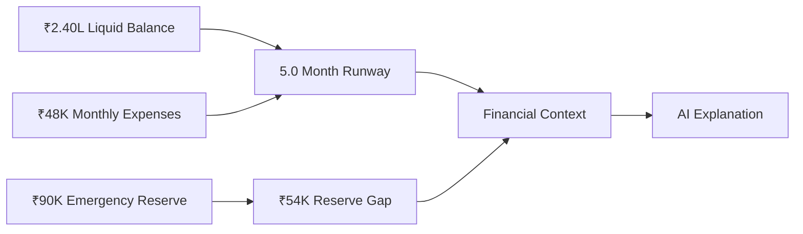

### System output

The system can explain that the user's **current liquidity provides a 5-month runway**, while the emergency reserve target is below the calculated 3-month benchmark.

The important property is traceability:

```text
Answer
  ↑
Calculated Metrics
  ↑
Financial Facts
  ↑
Neo4j Context
```

---

# Case Study 02 — Purchase Safety

### User question

> **"Can I afford a ₹35,000 laptop?"**

### Retrieved context

| Factor           |      Value |
| ---------------- | ---------: |
| Liquidity        |  ₹1,80,000 |
| Monthly expenses |    ₹46,000 |
| Savings rate     |        24% |
| EMI              |    ₹18,000 |
| Emergency runway | 4.1 months |
| Purchase         |    ₹35,000 |

### Decision pipeline

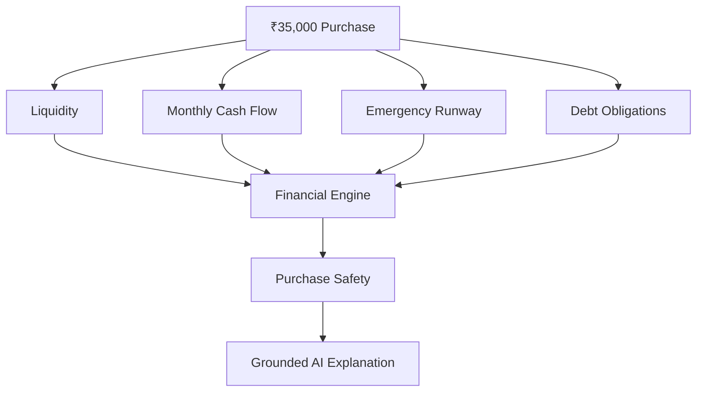

Instead of:

```text
YES
```

the assistant can expose the financial factors that produced the assessment.

That turns the product from a **binary affordability calculator** into an **explainable decision-support workflow**.

---

# Case Study 03 — Monthly Financial Health

### Example financial state

```text
Income                    ₹1,25,000
Expenses                    ₹72,000
Monthly Savings             ₹53,000
Outstanding Debt           ₹2,10,000
Savings Rate                  42.4%
Emergency Runway              7.2 mo
Debt-to-Income                18%
```

### Derived financial state

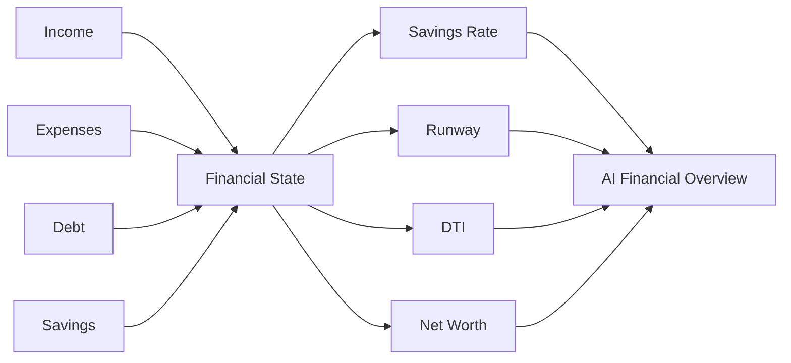

The result is a **state-level financial summary**, rather than four unrelated statistics.

---

# Case Study 04 — Natural Language Transaction

### Input

> **"I received ₹1,20,000 salary today and spent ₹4,500 on groceries."**

### Extraction

```text
INCOME
₹1,20,000
Salary
Today

EXPENSE
₹4,500
Groceries
Today
```

### Graph update

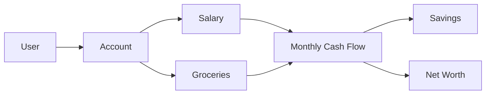

### Result

The transaction is no longer just a row in a table.

It becomes a new event inside the user's connected financial state.

---

# Portfolio Intelligence

Investment information is treated as another part of the user's financial graph.

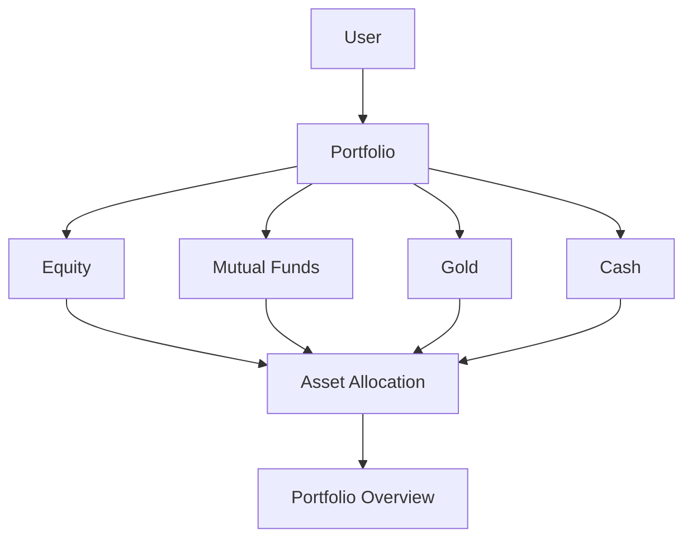

The repository also integrates market-context tooling through **OpenBB / Yahoo Finance**, alongside the application's portfolio layer.

---

# Financial Graph

The complete financial state can be viewed conceptually as:

```text
                              USER
                                │
       ┌────────────────────────┼────────────────────────┐
       │                        │                        │
       ▼                        ▼                        ▼
    ACCOUNTS                 GOALS                  PORTFOLIO
       │                        │                        │
   ┌───┴────┐                   │                 ┌──────┼──────┐
   ▼        ▼                   ▼                 ▼      ▼      ▼
 INCOME   EXPENSES         EMERGENCY FUND       EQUITY   MF    GOLD
   │        │
   └────┬───┘
        ▼
    CASH FLOW
        │
   ┌────┼──────────────┐
   ▼    ▼              ▼
 SAVINGS  RUNWAY       DEBT
                       │
                       ▼
                      EMI
```

This is the structural layer that makes relationship-aware financial reasoning possible.

---

# Architecture: Data → Reasoning → Explanation

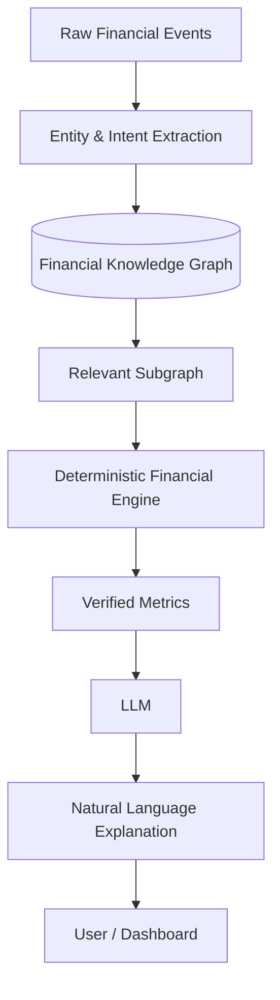

The system deliberately keeps the **calculation layer separate from the language model**.

---

# Feature Map

| Domain       | Capability                               |
| ------------ | ---------------------------------------- |
| Transactions | Natural-language transaction ingestion   |
| Cash Flow    | Income / expense analysis                |
| Savings      | Savings-rate tracking                    |
| Debt         | EMI and debt analysis                    |
| Resilience   | Emergency-fund and runway analysis       |
| Wealth       | Net-worth tracking                       |
| Portfolio    | Asset allocation and performance context |
| Goals        | Milestone and reserve tracking           |
| Intelligence | Graph-based contextual retrieval         |
| AI           | Grounded conversational explanations     |
| Analytics    | Interactive dashboard visualizations     |

---

# Technology Stack

```text
                    FINANCEFLOW AI

       ┌─────────────────────────────────────┐
       │              Streamlit              │
       │          Analytics Interface        │
       └──────────────────┬──────────────────┘
                          │
       ┌──────────────────▼──────────────────┐
       │               FastAPI               │
       │              API Layer               │
       └──────────────────┬──────────────────┘
                          │
       ┌──────────────────▼──────────────────┐
       │              Python                 │
       │       Financial Logic / Services    │
       └───────────────┬───────────┬─────────┘
                       │           │
             ┌─────────▼───┐   ┌──▼──────────┐
             │    Neo4j    │   │  LLM Layer  │
             │ Financial   │   │ Explanation │
             │   Graph     │   └─────────────┘
             └─────────────┘
```

| Layer         | Technology             |
| ------------- | ---------------------- |
| Language      | Python 3.10+           |
| API           | FastAPI                |
| Database      | Neo4j                  |
| Frontend      | Streamlit              |
| Visualization | Plotly                 |
| Retrieval     | GraphRAG               |
| AI            | LLM integration        |
| Market data   | OpenBB / Yahoo Finance |

---

# Repository Structure

```text
Personal_Finance_AI_v1/
│
├── app.py
├── run_cli.py
├── run_tests.py
├── requirements.txt
│
├── backend/
│   ├── main.py
│   ├── config.py
│   │
│   ├── app/
│   │   ├── api/
│   │   ├── database/
│   │   ├── engine/
│   │   ├── market/
│   │   ├── nlu/
│   │   ├── rag/
│   │   └── services/
│   │
│   └── tests/
│
├── frontend/
│   ├── streamlit_app.py
│   ├── api_client.py
│   ├── charts.py
│   ├── styles.py
│   └── src/
│
├── assets/
│   ├── dashboard-overview.png
│   ├── networth.png
│   ├── cashflow-analysis.png
│   ├── portfolio-analysis.png
│   ├── goal-progress.png
│   ├── graph-view.png
│   └── financeflow-demo.gif
│
├── .env.example
└── README.md
```

---

# Quick Start

### 1. Clone

```bash
git clone <your-repository-url>
cd Personal_Finance_AI_v1
```

### 2. Environment

```bash
python -m venv .venv
```

Windows:

```powershell
.\.venv\Scripts\Activate.ps1
```

Linux / macOS:

```bash
source .venv/bin/activate
```

### 3. Install

```bash
pip install -r requirements.txt
```

### 4. Configure

Create `.env` from `.env.example` and configure the required services.

```env
NEO4J_URI=neo4j://127.0.0.1:7687
NEO4J_USERNAME=neo4j
NEO4J_PASSWORD=your_password
NEO4J_DATABASE=finance-ai-antigravity

GROQ_API_KEY=your_api_key
```

### 5. Start Neo4j

Make sure the local Neo4j instance is running.

### 6. Seed demo data

```bash
python -m backend.scripts.seed_db
```

### 7. Start API

```bash
uvicorn backend.main:app --reload --port 8000
```

### 8. Launch dashboard

```bash
streamlit run frontend/streamlit_app.py
```

---

# What Happens When You Ask a Question?

```text
"Can I afford this?"

            ↓

┌─────────────────────────┐
│  Understand the intent  │
└────────────┬────────────┘
             ↓
┌─────────────────────────┐
│ Retrieve financial      │
│ relationships           │
└────────────┬────────────┘
             ↓
┌─────────────────────────┐
│ Calculate actual        │
│ financial metrics       │
└────────────┬────────────┘
             ↓
┌─────────────────────────┐
│ Produce evidence        │
└────────────┬────────────┘
             ↓
┌─────────────────────────┐
│ Explain the result      │
└─────────────────────────┘
```

The final answer is therefore the **last stage of the pipeline**, not the first.

---

# Responsible Use

FinanceFlow AI is a research and engineering project.

It is not:

* a licensed financial advisor
* a regulated financial product
* a guarantee of investment performance
* a substitute for professional financial advice

Market and financial outputs can be affected by incomplete data, assumptions, model limitations, and changing external conditions.

---

# Roadmap

```text
CURRENT
 │
 ├── Financial graph
 ├── Natural-language finance
 ├── Deterministic financial engine
 ├── GraphRAG
 ├── Dashboard analytics
 └── AI explanations
       │
       ▼
NEXT
 │
 ├── Scenario simulation
 ├── What-if analysis
 ├── Goal forecasting
 ├── Anomaly detection
 ├── Rich graph visualization
 └── Deeper portfolio analytics
       │
       ▼
LONG TERM
 │
 ├── Continuous financial monitoring
 ├── Agentic financial workflows
 └── Multimodal financial intelligence
```

---

# The Architecture in One Line

```text
Financial Events
      ↓
Connected Graph
      ↓
Deterministic Mathematics
      ↓
Verified Financial State
      ↓
AI Explanation
```

### That is FinanceFlow AI.

<p align="center">
  <strong>Graph × Financial Mathematics × AI × Analytics</strong>
</p>
