# FinanceFlow AI

<p align="center">
  
  
  
  
</p>

FinanceFlow AI is a graph-powered personal finance intelligence engine that combines trustworthy financial math, relationship-aware data storage, and an AI assistant that explains decisions clearly.

It is designed for users who want more than a budgeting app: they want a system that understands their financial life as a connected network of income, spending, debt, goals, and assets.

---

## Why this model matters

Traditional finance tools often rely on isolated numbers or generic LLM suggestions. That creates two major problems:

- the AI may give advice without real financial context,
- the math can be opaque, inconsistent, or not grounded in the user’s actual financial state.

FinanceFlow AI addresses that gap by building a layered system:

1. a Neo4j graph stores financial facts and relationships,
2. a Python financial engine calculates the real metrics,
3. GraphRAG retrieves only relevant connected context,
4. the assistant turns that evidence into helpful, explainable guidance.

This creates a finance system that is both intelligent and auditable.

---

## What the system does

- parses natural-language transactions like “I spent ₹2,500 on groceries yesterday”
- updates the user’s financial graph automatically
- calculates savings rate, runway, debt burden, and net worth
- evaluates whether a purchase is financially safe
- tracks goals, reserves, and portfolio performance
- communicates insights through a dashboard and AI assistant interface

---

## Live-style analytics view

The app produces a modern financial dashboard with live metrics and charts, similar to a wealth intelligence portal.

```text
┌─────────────────────────────────────────────────────────────┐
│ Executive Wealth Overview                                   │
├─────────────────────────────────────────────────────────────┤
│ Total Net Worth      ₹18,45,000     Savings Rate     28.4% │
│ Portfolio Value      ₹9,20,000      Financial Health 82/100 │
│ Monthly Savings      ₹42,000        Emergency Runway 6.2 mo │
└─────────────────────────────────────────────────────────────┘

 Asset Allocation               Cashflow Health
   45% Equity                     ┌─────┐ ┌─────┐
   30% Mutual Funds               │     │ │     │
   15% Gold                      │  ▆  │ │  ▆  │
   10% Cash                      │  ▆  │ │  ▆  │
                                  └─────┘ └─────┘
```

This is the kind of intelligence a user sees in the dashboard:
- current net worth,
- savings behavior,
- debt pressure,
- asset composition,
- upcoming financial risk or opportunity.

---

## Architecture: how the model works

```mermaid
flowchart LR
    A[User query or transaction] --> B[Natural Language Understanding]
    B --> C[Financial fact extraction]
    C --> D[Neo4j Knowledge Graph]
    D --> E[GraphRAG subgraph retrieval]
    E --> F[Python Financial Engine]
    F --> G[Verified metrics and evidence]
    G --> H[LLM response generation]
    H --> I[Dashboard / API / Assistant]
```



### Step 1: Data enters as everyday language
A user might say:

- “I got my salary today.”
- “Spent ₹3,400 on rent.”
- “I have a home loan EMI of ₹24,000.”
- “I want to know if I can afford a new laptop.”

The system interprets these into structured financial entities such as income, expense, debt, and account balance.

### Step 2: Structured facts are stored in a graph
Instead of storing only flat rows, the project models relationships such as:

- User → has account
- Account → receives income
- Income → belongs to month
- Expense → category → groceries
- Loan → EMI obligation
- Goal → emergency fund target

This creates a smarter, explainable representation of financial life.

### Step 3: The graph retrieves only relevant context
When a question is asked, the system doesn’t dump an entire database into the model. It finds the relevant connected subgraph for that query.

For example, if the user asks, “Am I ready for a purchase?” the system may retrieve:
- account balances,
- monthly expenses,
- current savings rate,
- loan obligations,
- emergency fund contribution status.

This narrows the decision to the precise financial facts that matter.

### Step 4: The Python engine calculates the truth
The model does not ask the LLM to do the financial arithmetic. Instead, it uses deterministic Python functions to compute:

- monthly income and expense totals,
- net worth,
- savings rate,
- emergency runway,
- debt-to-income ratio,
- financial health score,
- purchase safety and affordability.

This ensures the numbers are not hallucinated and remain explainable.

### Step 5: The assistant explains the result clearly
The final response combines:
- calculated metrics,
- user-specific graph context,
- and a concise natural-language explanation.

Example:

> Your emergency runway is 5.8 months, which is healthy. Your savings rate is 26%, and your debt-to-income ratio is 22%, which is within a manageable range. You can likely afford a moderate discretionary purchase, but your emergency fund remains the strongest lever for improving resilience.

---

## Case study 1: Emergency fund assessment

### Scenario
A user wants to know whether they are financially prepared for a medical emergency.

### Input facts
- monthly spending: ₹48,000
- account balance: ₹2,40,000
- current emergency goal: ₹90,000
- monthly income: ₹1,20,000

### What the engine computes
- recommended emergency reserve = 3 × monthly expenses = ₹1,44,000
- current emergency fund = ₹90,000
- shortfall = ₹54,000
- runway = ₹2,40,000 / ₹48,000 = 5.0 months

### Interpretation
The system can clearly explain:
- the user has a healthy runway,
- but the current emergency target is still below the recommended threshold,
- therefore the user should prioritize building reserve capacity before taking high discretionary risk.

---

## Case study 2: Purchase safety evaluation

### Scenario
User asks: “Am I safe to buy a ₹35,000 laptop?”

### Retrieved context
- current savings rate: 24%
- monthly expenses: ₹46,000
- total liquidity: ₹1,80,000
- active EMI: ₹18,000
- emergency runway: 4.1 months

### Engine outcome
The purchase safety check may conclude:
- purchase amount is below the safe discretionary threshold,
- the user still has enough liquidity,
- as long as the purchase does not reduce emergency reserves below target.

### Final explanation
The assistant responds with a grounded recommendation rather than a vague “yes/no.”

---

## Case study 3: Monthly financial health overview

### Example user profile
- income: ₹1,25,000
- expenses: ₹72,000
- savings: ₹53,000
- debts: ₹2,10,000 outstanding
- savings rate: 42.4%
- runway: 7.2 months
- DTI: 18%

### Result
The system identifies:
- strong savings habit,
- healthy debt ratio,
- good emergency cushion,
- top financial strength: consistent surplus generation.

This becomes the basis for practical coaching such as:
- continue investing aggressively,
- increase emergency reserve slowly,
- focus on long-term goal completion.

---

## Key product features

### Portfolio intelligence
- present value tracking,
- asset allocation,
- performance snapshots,
- portfolio health overview.

### Goal tracking
- emergency fund goals,
- milestone-based progress,
- ROI and savings alignment.

### Explainable assistant
- grounded responses,
- evidence-bound reasoning,
- less hallucination risk,
- clearer decisions for users.

---

## Tech stack

- Python 3.10+
- FastAPI
- Neo4j graph database
- Streamlit dashboard
- Plotly charts
- LLM integration for assistant explanations
- OpenBB / Yahoo Finance data sources

---

## Repository structure

```text
Personal_Finance_AI_v1/
├── app.py
├── run_cli.py
├── run_tests.py
├── requirements.txt
├── .env.example
├── backend/
│   ├── main.py
│   ├── config.py
│   ├── app/
│   │   ├── api/
│   │   ├── database/
│   │   ├── engine/
│   │   ├── market/
│   │   ├── nlu/
│   │   ├── rag/
│   │   └── services/
│   └── tests/
├── frontend/
│   ├── streamlit_app.py
│   ├── api_client.py
│   ├── charts.py
│   ├── styles.py
│   └── src/
└── README.md
```

---

## Quick start

### 1. Create a virtual environment

```bash
python -m venv .venv
source .venv/bin/activate
```

On Windows PowerShell:

```powershell
python -m venv .venv
.\.venv\Scripts\Activate.ps1
```

### 2. Install dependencies

```bash
pip install -r requirements.txt
```

### 3. Configure environment

```bash
cp .env.example .env
```

Update the values in `.env`:

```env
NEO4J_URI=neo4j://127.0.0.1:7687
NEO4J_USERNAME=neo4j
NEO4J_PASSWORD=your_password
NEO4J_DATABASE=finance-ai-antigravity
GROQ_API_KEY=your_api_key
```

### 4. Start Neo4j

Make sure the graph database is running locally.

### 5. Seed demo data

```bash
python -m backend.scripts.seed_db
```

### 6. Run the backend

```bash
uvicorn backend.main:app --reload --port 8000
```

### 7. Launch the dashboard

```bash
streamlit run frontend/streamlit_app.py
```

Or:

```bash
python app.py
```

---

## Example user prompts

- “What is my current financial health score?”
- “Can I afford a new phone?”
- “How much emergency fund do I need?”
- “Show my portfolio allocation and return trend.”
- “Add my salary and recent grocery spending.”

---

## Why it stands out

This project combines the strengths of graph databases, deterministic calculations, and explainable AI into a single finance system. It is designed to help users trust the recommendations they receive and understand how the numbers are formed.

---

## License

This project is intended for research, learning, and demo usage. Add a production license before deployment to production environments.

---

## Final summary

FinanceFlow AI is more than a finance dashboard. It is a practical financial reasoning system that turns user data into trustworthy insight, connects the full financial picture, and explains decisions in a way people can act on.
