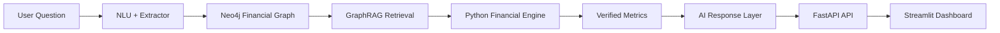

# FinanceFlow AI

<p align="center">
  
  
  
  
</p>

FinanceFlow AI is a Python-first personal finance intelligence system designed to turn raw spending, income, debt, and portfolio data into actionable insights using a graph-backed financial model and explainable AI.

## Why this project matters

Most finance apps stop at tracking numbers. This project goes further by combining:
- financial data in a Neo4j knowledge graph,
- deterministic Python-based financial calculations,
- GraphRAG retrieval for relevant context,
- and a polished dashboard for everyday planning.

The result is a system that helps users understand wealth, health score, affordability, emergency runway, and portfolio performance with much more clarity.

---

## What it does

- Natural-language transaction entry for income and expenses
- Savings rate, emergency fund, debt-to-income, and net-worth analytics
- Goal management and financial health scoring
- Portfolio intelligence and market-aware summaries
- AI-generated explanations grounded in verified financial context
- FastAPI backend + Streamlit dashboard for interactive use

## System overview



---

## Key features

### Financial health engine
- Monthly savings rate
- Emergency runway in months
- Debt burden and DTI analysis
- Purchase safety scoring
- Comprehensive financial health grade

### Portfolio intelligence
- Current portfolio value
- Asset allocation
- Return and P&L insights
- Market context and overview cards

### Explainable AI
- Context-aware answers grounded in the user graph
- Finance calculations performed in code rather than hidden in an LLM
- Better trust, better reasoning, and clearer guidance

---

## Project structure

```text
Personal_Finance_AI_v1/
├── app.py
├── run_cli.py
├── run_tests.py
├── requirements.txt
├── .env.example
├── backend/
│   ├── main.py
│   ├── config.py
│   ├── app/
│   │   ├── api/
│   │   ├── database/
│   │   ├── engine/
│   │   ├── market/
│   │   ├── nlu/
│   │   ├── rag/
│   │   └── services/
│   └── tests/
├── frontend/
│   ├── streamlit_app.py
│   ├── api_client.py
│   ├── charts.py
│   ├── styles.py
│   └── src/
└── README.md
```

---

## Tech stack

- Python 3.10+
- FastAPI
- Neo4j
- Streamlit
- Plotly
- Groq/OpenAI-style LLM integration
- OpenBB and Yahoo Finance data providers

---

## Quick start

### 1. Create a virtual environment

```bash
python -m venv .venv
source .venv/bin/activate
```

On Windows PowerShell:

```powershell
python -m venv .venv
.\.venv\Scripts\Activate.ps1
```

### 2. Install dependencies

```bash
pip install -r requirements.txt
```

### 3. Configure environment

```bash
cp .env.example .env
```

Update values in `.env`:

```env
NEO4J_URI=neo4j://127.0.0.1:7687
NEO4J_USERNAME=neo4j
NEO4J_PASSWORD=your_password
NEO4J_DATABASE=finance-ai-antigravity
GROQ_API_KEY=your_api_key
```

### 4. Start Neo4j

Make sure your local Neo4j instance is running.

### 5. Seed demo data

```bash
python -m backend.scripts.seed_db
```

### 6. Run the backend

```bash
uvicorn backend.main:app --reload --port 8000
```

### 7. Launch the dashboard

```bash
streamlit run frontend/streamlit_app.py
```

Or from the root:

```bash
python app.py
```

---

## Example prompts

- What is my current financial health score?
- Am I safe to make this purchase?
- How much emergency fund do I need?
- What is my monthly savings rate?
- Show my portfolio allocation and profit/loss.
- Log my salary and grocery expenses in natural language.

---

## Why it stands out

This project is built around trustable financial reasoning instead of black-box suggestions. The engine calculates the core outputs in Python, while the assistant uses graph context to explain the result in plain language. That makes the system far more useful for real financial decision-making.

---

## License

This project is intended for research, learning, and portfolio/demo use. Add your preferred license before commercial deployment.

---

## Summary

FinanceFlow AI brings together graph intelligence, deterministic financial logic, and AI-powered explanation to create a practical personal finance assistant for modern users.
