# 💸 FinanceFlow AI

<p align="center">
  
  
  
  
  
</p>

<p align="center">
  <strong>🧠 A graph-powered personal finance intelligence system</strong>
</p>

<p align="center">
  <em>Understand your money. Connect the relationships. Calculate the facts. Explain the decision.</em>
</p>

<p align="center">

**Natural Language → Financial Graph → Deterministic Engine → AI Reasoning → Actionable Insight**

</p>

---

# ⚡ FinanceFlow in 30 Seconds

FinanceFlow AI is a **personal finance intelligence engine** that combines:

**Neo4j graph relationships**
+
**deterministic Python financial calculations**
+
**GraphRAG context retrieval**
+
**LLM-powered explanations**
+
**interactive financial analytics**

Instead of asking an LLM to "figure out your finances", FinanceFlow first builds a structured representation of the user's financial life, calculates the important numbers deterministically, and then uses AI to explain those results.

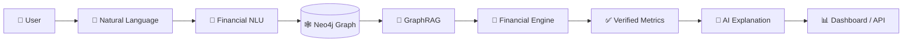

---

# 🚨 Why Not Just Use ChatGPT for Personal Finance?

A generic AI assistant has two fundamental weaknesses when used for financial reasoning:

```text
                  GENERIC AI
                      │
          ┌───────────┴───────────┐
          ▼                       ▼
    Missing context         Unreliable math
          │                       │
          └───────────┬───────────┘
                      ▼
             Vague financial advice
```

FinanceFlow changes the architecture:

```text
                  FINANCEFLOW
                       │
        ┌──────────────┼──────────────┐
        ▼              ▼              ▼
   Financial        Graph           Deterministic
    Facts         Relationships       Math
        │              │              │
        └──────────────┼──────────────┘
                       ▼
                Relevant Context
                       │
                       ▼
                  AI Explanation
```

### The core design principle

> **LLM for understanding and explanation.
> Graph for relationships.
> Python for financial truth.**

That separation is what makes the system more auditable and grounded.

---

# 🧬 The Financial Intelligence Loop

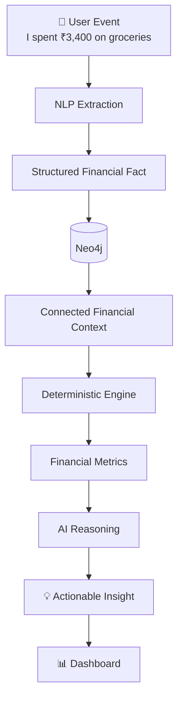

Every interaction becomes part of a continuously connected financial picture.

---

# 📊 What FinanceFlow Understands

FinanceFlow models a financial life as interconnected entities rather than isolated transactions.

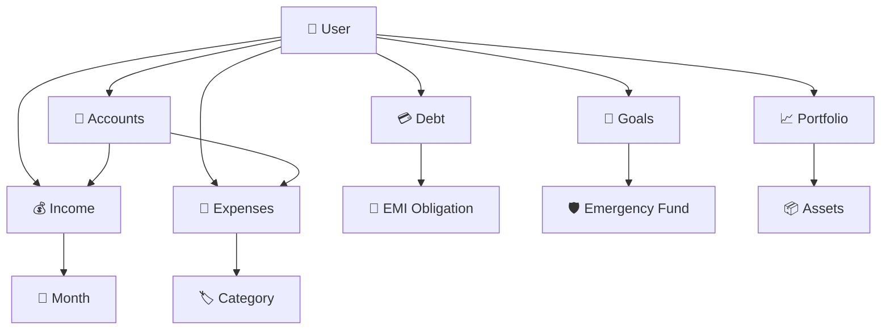

This allows the system to reason across relationships such as:

```text
User
 ├── receives → Income
 ├── spends → Expenses
 ├── owns → Assets
 ├── owes → Debt
 ├── tracks → Goals
 └── invests through → Portfolio
```

---

# 🎯 The Difference: A Connected Financial Brain

A traditional budgeting application may see:

```text
₹3,400 → Groceries
₹18,000 → EMI
₹1,20,000 → Salary
```

FinanceFlow attempts to understand the relationships:

```text
                    USER
                      │
        ┌─────────────┼─────────────┐
        ▼             ▼             ▼
      Income        Spending       Debt
        │             │             │
        ▼             ▼             ▼
     ₹1.2L         ₹46K/month     ₹18K EMI
        │             │             │
        └───────┬─────┴──────┬──────┘
                ▼            ▼
             Savings       DTI
                │            │
                └──────┬─────┘
                       ▼
               Financial Health
```

The graph is therefore not just a database.

It acts as the **relationship layer of the financial reasoning system**.

---

# 💬 Natural Language → Financial Intelligence

The user does not need to manually populate every field.

### Example

```text
"I got my salary today."

"I spent ₹3,400 on groceries."

"I have a ₹24,000 home-loan EMI."

"Can I afford a ₹35,000 laptop?"
```

The system converts these interactions into structured information.

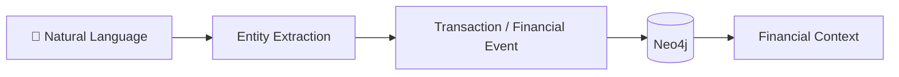

---

# 🧮 The Deterministic Financial Engine

This is one of the most important parts of the architecture.

The LLM is **not responsible for calculating the financial metrics**.

Instead:

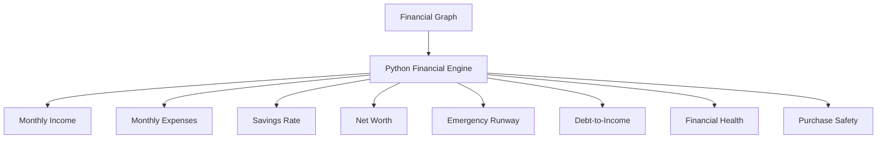

This separation makes the calculations explicit and testable.

### Example formulas

```text
Savings Rate
= (Income − Expenses) / Income

Emergency Runway
= Liquid Reserves / Monthly Expenses

Net Worth
= Assets − Liabilities

DTI
= Debt Payments / Gross Income
```

The system then gives the AI the **calculated evidence** rather than asking the model to invent the arithmetic.

---

# 🔎 GraphRAG: Retrieve What Actually Matters

Suppose a user asks:

> **"Can I afford a ₹35,000 laptop?"**

FinanceFlow does not need the user's entire financial database.

It can retrieve the relevant context:

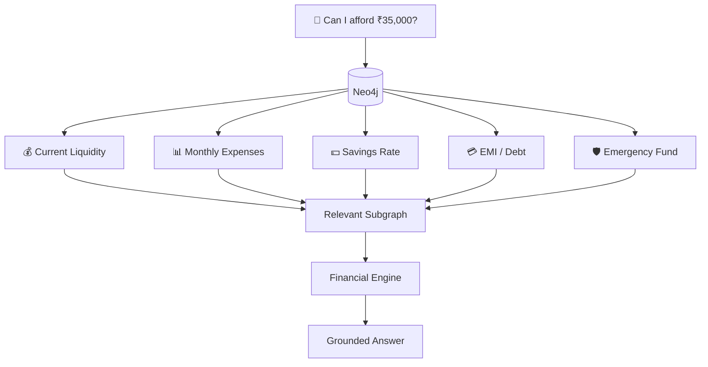

This is the role of **GraphRAG** in the system:

> retrieve the relationships that matter for the question, calculate from those facts, and then explain the result.

---

# 📈 LIVE ANALYTICS

The Streamlit application turns the underlying financial graph into an interactive dashboard.

Recommended dashboard sections:

```text
┌──────────────────────────────────────────────────────────────┐
│                  FINANCEFLOW EXECUTIVE VIEW                  │
├──────────────────────────────────────────────────────────────┤
│                                                              │
│  NET WORTH       SAVINGS RATE      RUNWAY       HEALTH       │
│  ₹18.45L          28.4%            6.2 mo       82/100       │
│                                                              │
├──────────────────────────────────────────────────────────────┤
│                                                              │
│  📈 Net Worth Trend              💸 Monthly Cash Flow        │
│                                                              │
│       ╱╲                       Income ███████████            │
│   ╱──╯  ╲──╮                   Spend  ████████               │
│ ─╯          ╰──                Save   ████                   │
│                                                              │
├──────────────────────────────────────────────────────────────┤
│                                                              │
│  🥧 Asset Allocation            🎯 Goal Progress             │
│                                                              │
└──────────────────────────────────────────────────────────────┘
```

### Suggested live charts from the application

Use actual Plotly outputs from the running dashboard for:

**Net Worth Trend**

**Income vs Expenses**

**Savings Rate**

**Asset Allocation**

**Portfolio Performance**

**Debt / EMI Load**

**Goal Progress**

**Emergency Fund Progress**

> Keep these charts generated from application data rather than inserting fake screenshots.

---

# 📊 Suggested Dashboard Visuals

Once the dashboard is running, place exported screenshots under:

```text
assets/
├── dashboard-overview.png
├── cashflow.png
├── networth.png
├── portfolio.png
└── goals.png
```

Then expose them in the README:

```markdown

```

```markdown

```

```markdown

```

This makes the GitHub page visually demonstrate the product instead of describing it abstractly.

---

# 🧪 CASE STUDY 01 — Emergency Fund Intelligence

### Scenario

A user asks:

> **"How financially prepared am I for an emergency?"**

### Input

| Metric                |     Value |
| --------------------- | --------: |
| Monthly expenses      |   ₹48,000 |
| Liquid balance        | ₹2,40,000 |
| Emergency-fund target |   ₹90,000 |
| Monthly income        | ₹1,20,000 |

### Financial engine

```text
Required reserve
= 3 × ₹48,000
= ₹1,44,000
```

```text
Current reserve
= ₹90,000
```

```text
Reserve shortfall
= ₹1,44,000 − ₹90,000
= ₹54,000
```

```text
Runway
= ₹2,40,000 / ₹48,000
= 5.0 months
```

### What the system sees

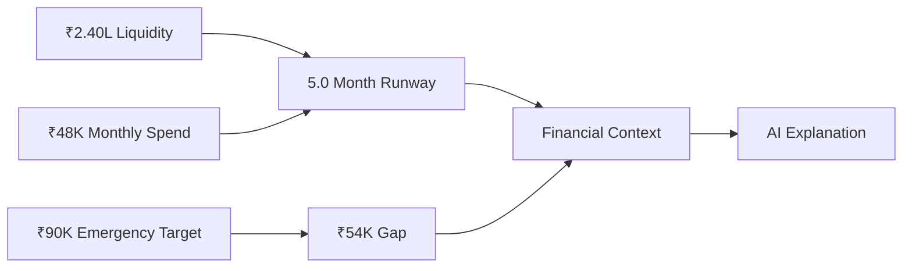

### Example output

> **Emergency resilience is supported by a 5-month liquidity runway, while the current emergency reserve target remains ₹54,000 below the calculated 3-month reserve benchmark.**

The important part is not the wording.

It is that the explanation is backed by **retrieved financial facts + deterministic calculations**.

---

# 💻 CASE STUDY 02 — "Can I Buy This?"

### User question

> **"Can I afford a ₹35,000 laptop?"**

### Retrieved financial context

| Factor           |      Value |
| ---------------- | ---------: |
| Monthly expenses |    ₹46,000 |
| Liquidity        |  ₹1,80,000 |
| Savings rate     |        24% |
| Active EMI       |    ₹18,000 |
| Emergency runway | 4.1 months |
| Purchase         |    ₹35,000 |

### Decision pipeline

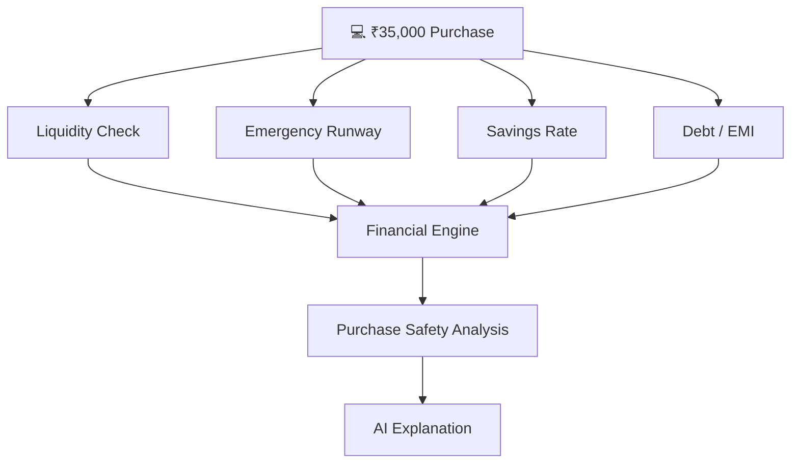

Instead of returning:

```text
YES ✅
```

FinanceFlow can explain **which financial factors produced the assessment**.

That is the difference between a calculator and a financial reasoning system.

---

# 📊 CASE STUDY 03 — Monthly Financial Health

### Example financial state

```text
Income              ₹1,25,000
Expenses              ₹72,000
Monthly Savings       ₹53,000
Outstanding Debt     ₹2,10,000
Savings Rate            42.4%
Emergency Runway        7.2 mo
DTI                       18%
```

### Derived state

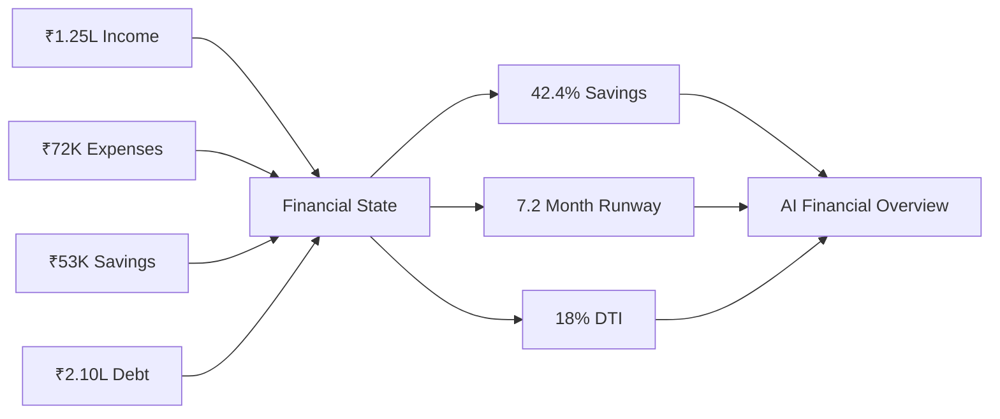

The assistant can then summarize the **current state of the financial system**, instead of discussing isolated transactions.

---

# 🕸️ Why Neo4j?

A relational table might store:

```text
transaction_id | category | amount | date
```

The graph can additionally represent relationships:

```text
User
 │
 ├── owns → Account
 │              │
 │              └── receives → Salary
 │
 ├── spends → Expense
 │              └── category → Groceries
 │
 ├── owes → Loan
 │            └── generates → EMI
 │
 ├── owns → Portfolio
 │            └── contains → Asset
 │
 └── targets → Goal
```

This makes connected queries much more natural.

### Example

```text
Purchase Question
       ↓
Account Balance
       ↓
Monthly Cash Flow
       ↓
Debt Obligations
       ↓
Emergency Fund
       ↓
Financial Goal
       ↓
Purchase Analysis
```

---

# 🤖 AI Layer

The AI layer sits **after the financial reasoning**, not before it.

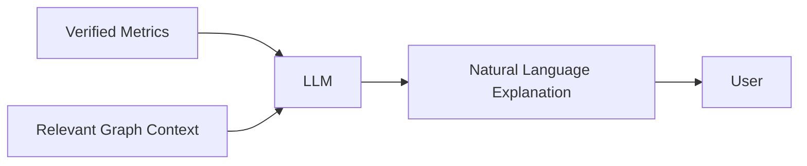

### AI handles

* conversational interaction
* explanation
* summarization
* contextual guidance
* natural-language understanding

### Deterministic engine handles

* financial calculations
* ratios
* totals
* runway
* savings
* debt metrics
* purchase calculations

This division is central to the architecture.

---

# 📦 Product Capabilities

| Module                      | What it provides                      |
| --------------------------- | ------------------------------------- |
| 💸 Transaction Intelligence | Natural-language financial events     |
| 🕸️ Financial Graph         | Connected financial entities          |
| 🧮 Financial Engine         | Deterministic calculations            |
| 🔎 GraphRAG                 | Relevant financial context            |
| 💳 Debt Intelligence        | EMI and debt analysis                 |
| 🛡️ Emergency Fund          | Reserve + runway analysis             |
| 💰 Net Worth                | Assets vs liabilities                 |
| 📈 Portfolio                | Investment / market context           |
| 🎯 Goals                    | Goal and milestone tracking           |
| 📊 Dashboard                | Interactive analytics                 |
| 🤖 AI Copilot               | Human-readable financial explanations |

---

# 🏗️ Full System Architecture

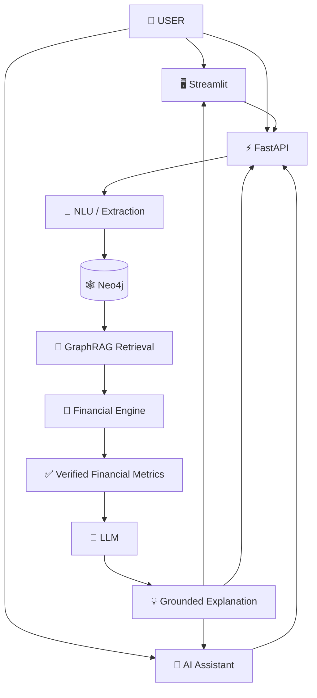

---

# 🔄 From Transaction to Insight

A complete interaction looks like this:

```text
USER
"I received ₹1,20,000 salary."

        ↓

NATURAL LANGUAGE UNDERSTANDING

        ↓

STRUCTURED FINANCIAL EVENT

        ↓

NEO4J
User → Account → Income → Month

        ↓

FINANCIAL RECOMPUTATION

        ↓

Income
Savings
Runway
Debt
Net Worth

        ↓

AI CONTEXT

        ↓

EXPLANATION

        ↓

DASHBOARD
```

---

# 📈 Financial Intelligence Dashboard

The dashboard should present **decision-relevant metrics**, not just decorative charts.

### Executive metrics

```text
┌────────────┬──────────────┬──────────────┬──────────────┐
│ NET WORTH  │ SAVINGS RATE │ RUNWAY       │ HEALTH       │
│ ₹18.45L    │ 28.4%        │ 6.2 months   │ 82 / 100     │
└────────────┴──────────────┴──────────────┴──────────────┘
```

### Cash-flow view

```text
Income
████████████████████████  ₹1,20,000

Expenses
██████████████            ₹72,000

Savings
████████                  ₹48,000
```

### Portfolio view

```text
Equity             █████████████████   45%
Mutual Funds       ███████████         30%
Gold               ██████              15%
Cash               ████                10%
```

These values are **illustrative examples**, not benchmark results.

---

# 🔬 Explainability by Design

FinanceFlow is designed so that a financial answer can be decomposed into:

```text
QUESTION
   ↓
RELEVANT FACTS
   ↓
GRAPH RELATIONSHIPS
   ↓
DETERMINISTIC CALCULATIONS
   ↓
RESULT
   ↓
AI EXPLANATION
```

This provides a much clearer reasoning trail than:

```text
Question
   ↓
LLM
   ↓
Trust me bro 😭
```

---

# 🧰 Technology Stack

<p align="center">

**Python** · **Neo4j** · **FastAPI** · **Streamlit** · **Plotly** · **GraphRAG** · **LLM** · **OpenBB / Yahoo Finance**

</p>

| Layer          | Technology             |
| -------------- | ---------------------- |
| Language       | Python 3.10+           |
| API            | FastAPI                |
| Graph Database | Neo4j                  |
| UI             | Streamlit              |
| Visualization  | Plotly                 |
| AI             | LLM integration        |
| Market Context | OpenBB / Yahoo Finance |

---

# 📁 Architecture at Code Level

```text
Personal_Finance_AI_v1/
│
├── app.py
├── run_cli.py
├── run_tests.py
├── requirements.txt
│
├── backend/
│   ├── main.py
│   ├── config.py
│   │
│   ├── app/
│   │   ├── api/
│   │   ├── database/
│   │   ├── engine/
│   │   ├── market/
│   │   ├── nlu/
│   │   ├── rag/
│   │   └── services/
│   │
│   └── tests/
│
├── frontend/
│   ├── streamlit_app.py
│   ├── api_client.py
│   ├── charts.py
│   ├── styles.py
│   └── src/
│
├── .env.example
└── README.md
```

---

# 🚀 Quick Start

## 1. Clone

```bash
git clone <your-repository-url>
cd Personal_Finance_AI_v1
```

## 2. Virtual environment

### Windows

```powershell
python -m venv .venv
.\.venv\Scripts\Activate.ps1
```

### Linux / macOS

```bash
python -m venv .venv
source .venv/bin/activate
```

## 3. Install

```bash
pip install -r requirements.txt
```

## 4. Environment

```bash
cp .env.example .env
```

Configure the required Neo4j and LLM credentials.

Example:

```env
NEO4J_URI=neo4j://127.0.0.1:7687
NEO4J_USERNAME=neo4j
NEO4J_PASSWORD=your_password
NEO4J_DATABASE=finance-ai-antigravity

GROQ_API_KEY=your_api_key
```

## 5. Start Neo4j

Ensure Neo4j is running locally.

## 6. Seed data

```bash
python -m backend.scripts.seed_db
```

## 7. Start API

```bash
uvicorn backend.main:app --reload --port 8000
```

## 8. Start dashboard

```bash
streamlit run frontend/streamlit_app.py
```

---

# 🎬 Recommended README Visuals

For the final GitHub page, create and place these **real screenshots generated from the actual running application**:

```text
assets/
│
├── hero-dashboard.png
├── financial-health.png
├── cashflow-analysis.png
├── portfolio-analysis.png
├── goal-progress.png
├── purchase-analysis.png
└── graph-view.png
```

Recommended order:

```text
README
  ↓
Hero Dashboard
  ↓
Architecture
  ↓
Graph Visualization
  ↓
Financial Health Chart
  ↓
Case Study
  ↓
Portfolio / Cash Flow
  ↓
Setup
```

This gives the repository a **product-demo feel** instead of a text-heavy academic README.

---

# 🧠 Design Philosophy

FinanceFlow is built around a simple separation of responsibilities:

```text
┌────────────────────────────────────────┐
│             USER INTERFACE             │
│         Streamlit / Assistant          │
└────────────────────┬───────────────────┘
                     ↓
┌────────────────────────────────────────┐
│              AI / NLU                  │
│      Understand intent & language      │
└────────────────────┬───────────────────┘
                     ↓
┌────────────────────────────────────────┐
│              GRAPH LAYER               │
│       Relationships + financial facts  │
└────────────────────┬───────────────────┘
                     ↓
┌────────────────────────────────────────┐
│          DETERMINISTIC ENGINE          │
│       Financial calculations & rules   │
└────────────────────┬───────────────────┘
                     ↓
┌────────────────────────────────────────┐
│          EXPLANATION LAYER             │
│       Grounded AI response generation  │
└────────────────────────────────────────┘
```

---

# ⚠️ Financial Safety

FinanceFlow is a software/research project and **not a licensed financial advisor**.

Outputs should be treated as analytical assistance rather than guaranteed financial advice.

Financial decisions should consider additional information, personal circumstances, and appropriate professional advice.

---

# 🛣️ Future Roadmap

```text
CURRENT
│
├── Natural-language finance
├── Neo4j financial graph
├── GraphRAG retrieval
├── Deterministic financial engine
├── Dashboard analytics
└── AI explanations
        │
        ▼
NEXT
│
├── Deeper portfolio analytics
├── Financial scenario simulation
├── Goal forecasting
├── What-if analysis
├── Automated anomaly detection
└── Richer graph visualization
        │
        ▼
LONG-TERM
│
├── Multimodal financial intelligence
├── Personalized financial simulations
├── Agentic financial workflows
└── Continuous financial monitoring
```

---

# ⭐ The Core Idea

FinanceFlow AI is not designed to be:

```text
"ChatGPT, but for money."
```

It is designed as:

```text
             FINANCIAL DATA
                   +
          RELATIONSHIP GRAPH
                   +
        DETERMINISTIC FINANCIAL MATH
                   +
             GRAPHRAG
                   +
          AI EXPLANATION
                   ↓
       ┌──────────────────────┐
       │ FINANCIAL INTELLIGENCE│
       └──────────────────────┘
```

The result is a system that can move from:

**raw financial events → connected financial state → calculated metrics → contextual reasoning → understandable action.**

---

<p align="center">

### 💸 FinanceFlow AI

**Turn financial data into financial understanding.**

<br/>

🕸️ **Graph**   ×   🧮 **Math**   ×   🤖 **AI**   ×   📊 **Analytics**

</p>
